# CatalogX: Open Agentic Commerce Protocol (ACP/UAP) Technical Specification

> **Track 01 — AI Growth & Agentic Commerce**  
> *Empowering merchants to become autonomously transactable by AI buyer agents with Razorpay settlement rails, bounded financial guardrails, and explainable auditability.*

---

## 1. Problem Statement

The rise of autonomous AI agents is shifting consumer commerce from manual human browsing to delegated agent-to-agent transactions. Initiatives like **NPCI's Universal Agent Protocol (UAP)** and emerging global standards (**ACP, AP2, x402**) represent a paradigm shift in how goods and services are discovered, negotiated, and settled.

However, existing e-commerce systems face critical bottlenecks when interacting with AI buyers:
1. **Unstructured & Machine-Incompatible Catalogs**: Traditional storefronts rely on visual HTML/CSS designed for human eyes, forcing agents to resort to brittle DOM scraping.
2. **Hallucination & Option Blindness**: Blind prompting leads buyer agents to ask irrelevant, repetitive questions or hallucinate unsupported options (e.g. asking for US/EU sizing when the merchant only stocks UK sizes).
3. **Financial Risk & Prompt Injection**: Delegating autonomous spending creates substantial attack vectors. Malicious third parties can inject commands into catalog metadata or attempt to drain user funds.
4. **Lack of Explainability & Real-Time Settlement**: Enterprises and users require deterministic spend bounds, full step-by-step audit trails, and instant Razorpay payment settlement without human friction for micro-transactions.

---

## 2. Terminology & Key Concepts

| Term | Definition |
| :--- | :--- |
| **UAP (Universal Agent Protocol)** | NPCI's standardized communication specification for agent-to-agent discovery, negotiation, and commerce in India. |
| **ACP (Agent Commerce Protocol)** | Open industry protocol standard defining how AI buyer agents query merchant capabilities, search inventory, and create orders. |
| **AP2 & x402** | Open protocols for machine-to-machine payment signaling and HTTP-native payment requirement headers. |
| **Agent-Readable Catalog (`/.well-known/agent-catalog`)** | Standardized, machine-readable JSON endpoint exposed by merchants declaring capabilities, category schemas, option requirements, and policies. |
| **Spend Governor (Guardrails)** | Deterministic code-level safety engine enforcing mathematical spend bounds across 3 approval tiers, preventing unauthorized payment execution. |
| **Micro-Spend e-Mandate** | Pre-authorized Razorpay recurring/mandate token permitting autonomous zero-click payments under strict ceiling thresholds (≤ ₹1,500). |
| **Dynamic Option Reconciliation** | Search-first process where the buyer agent queries the catalog before prompting, only requesting options strictly mandated by the product schema. |
| **Dynamic AI Upsell** | Merchant-driven cross-sell engine that evaluates bundle offers and automatically applies discounts if total spend stays within budget bounds. |
| **Multi-Tenant Session Store** | User-isolated MongoDB Atlas architecture storing conversation threads and structured audit events scoped by `userId` and `sessionId`. |

---

## 3. Proposed Solution: CatalogX Architecture

**CatalogX** is an end-to-end agentic commerce framework connecting autonomous AI buyers to merchant storefronts with Razorpay payment rails.

### Core Architectural Pillars

```
                     ┌─────────────────────────────────────────────────────────┐
                     │                   CATALOGX PLATFORM                     │
                     │  (Multi-Tenant Dashboard • Next.js 16 • MongoDB Atlas)   │
                     └────────────────────────────┬────────────────────────────┘
                                                  │
                                                  ▼
                     ┌─────────────────────────────────────────────────────────┐
                     │              AUTONOMOUS BUYER AGENT RUNTIME             │
                     │  (Domain-Agnostic Intent • Session Memory • Reasoning)  │
                     └───────────────┬─────────────────────────┬───────────────┘
                                     │                         │
               Federated Catalog     │                         │  Spend Governor
               Discovery & Search    │                         │  (Deterministic)
                                     ▼                         ▼
            ┌──────────────────────────────────┐     ┌──────────────────────────────────┐
            │   AGENT-READABLE MERCHANT APIS   │     │    RAZORPAY SETTLEMENT RAILS     │
            │   (/.well-known/agent-catalog)   │     │ (Tier 1 Mandate • Tier 2/3 2FA)  │
            ├──────────────────────────────────┤     ├──────────────────────────────────┤
            │ • UrbanStride (Footwear - 3001)  │     │ • Pre-Authorized TokenHQ Mandate │
            │ • TechCart (Electronics - 3002)  │     │ • 1-Click Human Consent / OTP    │
            └──────────────────────────────────┘     └──────────────────────────────────┘
```

---

## 4. End-to-End System Flow & Architecture Diagram

```mermaid
sequenceDiagram
    autonumber
    actor User as Human Buyer
    participant Dash as CatalogX Dashboard (Port 3000)
    participant Mongo as MongoDB Atlas (catalogx_db)
    participant Agent as Buyer Agent Core (NLU & Reasoning)
    participant Merchant as Merchant Server (Port 3001 / 3002)
    participant Razorpay as Razorpay Payment Gateway

    User->>Dash: "I want to buy some shoes under 1500"
    Dash->>Mongo: Append user message to chat_sessions
    Dash->>Agent: Spawn Buyer Agent (sessionId, userId)
    
    rect rgb(20, 30, 45)
        Note over Agent,Mongo: Phase 1: Context & Intent Parsing
        Agent->>Mongo: Load conversation history
        Agent->>Agent: Parse universal intent (query="shoes", max_budget=150000)
    end

    rect rgb(25, 40, 35)
        Note over Agent,Merchant: Phase 2 & 3: Catalog Discovery & Search
        Agent->>Merchant: GET /.well-known/agent-catalog
        Merchant-->>Agent: Manifest (Capabilities, Policies, Standard)
        Agent->>Merchant: POST /api/products/search (max_price=150000)
        Merchant-->>Agent: Candidate products with required_options & offers
    end

    rect rgb(45, 35, 20)
        Note over Agent,User: Phase 4: Grounded Option Reconciliation
        Agent->>Agent: Inspect product required_options (Size is required)
        Agent->>Dash: Prompt with real in-stock options (UK 6 to 12)
        User->>Dash: "8 would work"
        Dash->>Agent: Re-invoke with follow-up
        Agent->>Agent: Resolve UK Size 8 & Select Best Match (HRX RUN - ₹1,499)
    end

    rect rgb(20, 40, 45)
        Note over Agent,Razorpay: Phase 5 & 6: Spend Gate & Settlement
        Agent->>Agent: Evaluate Spend Governor (₹1,499 <= ₹1,500 -> TIER 1 AUTO)
        Agent->>Merchant: POST /api/orders (product_id, size="8", customer, shipping)
        Merchant->>Razorpay: razorpay.orders.create(amount=149900)
        Razorpay-->>Merchant: razorpay_order_id
        Merchant-->>Agent: Order created + Dynamic Upsell Offer
        Agent->>Merchant: POST /api/payments/simulate (Execute e-Mandate)
        Merchant->>Razorpay: Capture & Verify HMAC Signature
        Merchant-->>Agent: Payment Captured (pay_xxx)
    end

    Agent->>Mongo: Persist complete audit trail & order record
    Agent-->>Dash: Render Order Summary, Audit Trail & Verification
```



---

## 5. How CatalogX Satisfies All Buildathon Requirements

### Requirement 1: "Make any merchant transactable by an AI buyer end-to-end"
- **Open Catalog Specification**: Any merchant implementing `/.well-known/agent-catalog` and standard search/order endpoints can be discovered and transacted with automatically.
- **Product-Driven Schema**: Products dynamically define their own `required_options` (e.g. size for shoes, volume for liquids, none for electronics) and `offers`, eliminating hardcoded domain rules.

### Requirement 2: "Grow merchant revenue (Upsell & Cross-Sell)"
- **Dynamic AI Upsell**: When creating an order, merchant agents propose contextual bundle offers (e.g. anti-blister socks for running shoes, protective case for headphones).
- **Budget-Bounded Cross-Sell**: If the bundle price fits within user budget bounds, it is presented in chat with 1-click upgrade options.

### Requirement 3: "The Bar: Every money action explainable, bounded and gated"
- **3-Tier Spend Governor**:
  - **Tier 1 (≤ ₹1,500)**: `AUTO` approval via pre-authorized e-mandate.
  - **Tier 2 (₹1,501 – ₹5,000)**: `REVIEW` requiring 1-click human consent.
  - **Tier 3 (> ₹5,000)**: `HIGH_VALUE_2FA` requiring mandatory OTP verification.
- **Audit Trail**: Every decision is logged with `action`, `input_data`, `output_data`, `reasoning`, and timestamp to MongoDB Atlas.

### e-Mandates: Test-Mode Simulation vs Production Architecture
> **Note on Test-Mode Implementation vs Live Production Rails:**
> * In this Buildathon repository, Tier 1 (≤ ₹1,500) autonomous payments simulate the recurring e-mandate token debit endpoint to demonstrate the zero-friction autonomous agent buyer experience without interactive test-mode modal interruptions.
> * In a live production deployment, this maps directly 1-to-1 to **Razorpay's Recurring Payments API** (`POST https://api.razorpay.com/v1/payments/create/recurring`) powered by **NPCI UPI AutoPay / e-NACH**:
>   1. **One-Time Mandate Consent**: The user authorizes an on-demand/as-presented spend ceiling (e.g., maximum ₹1,500 per transaction) once with their UPI PIN or 3DS OTP.
>   2. **Autonomous Execution**: The backend invokes Razorpay's recurring token endpoint with the stored `mandate_token` and the variable cart amount (e.g., ₹1,299), settling funds server-to-server without an OTP prompt.
>   3. **Regulatory Gating**: Transactions exceeding the authorized ceiling or monthly threshold automatically fall back to Tier 2 (1-Click consent) or Tier 3 (2FA OTP) per RBI e-mandate guidelines.

### Requirement 4: "One failure handled gracefully"
- **Automated Stock-Out Fallback**: If an item goes out of stock between search and checkout, the agent intercepts the failure, discovers the next best in-stock alternative, and continues without crash.
- **Payment Retry with Exponential Backoff**: Transient payment gateway network failures are retried automatically up to 3 times before graceful user notification.

---

## 6. Verification Results & Benchmarks

| Test Scenario | Input Query | Discovered Merchant | Option Handling | Spend Tier | Outcome |
| :--- | :--- | :--- | :--- | :--- | :--- |
| **Footwear Search** | *"I want shoes under 1500"* ➔ *"8 would work"* | UrbanStride (Port 3001) | Prompted for UK size (UK 6-12) | Tier 1 (AUTO) | Order Created & Mandate Paid (`HRX RUN` ₹1,499) |
| **Electronics Search** | *"Buy me boAt headphones under 2000"* | TechCart (Port 3002) | 0 redundant questions asked | Tier 1 (AUTO) | Order Created with Hard-Shell Case Offer (`boAt Rockerz` ₹1,499) |
| **High-Value 2FA Gating** | *"Buy Sony WH-1000XM5"* | TechCart (Port 3002) | Evaluated ₹29,990 price | Tier 3 (2FA) | Gated for Human OTP Authorization |
| **Out-of-Budget Search** | *"Buy Nike shoes under 1000"* | UrbanStride (Port 3001) | Relaxed search fallback | Policy Block | Suggested closest in-stock items (`Campus` ₹999) |
